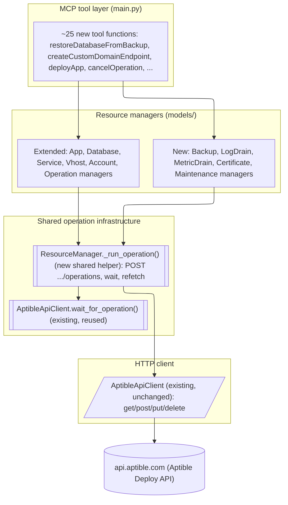
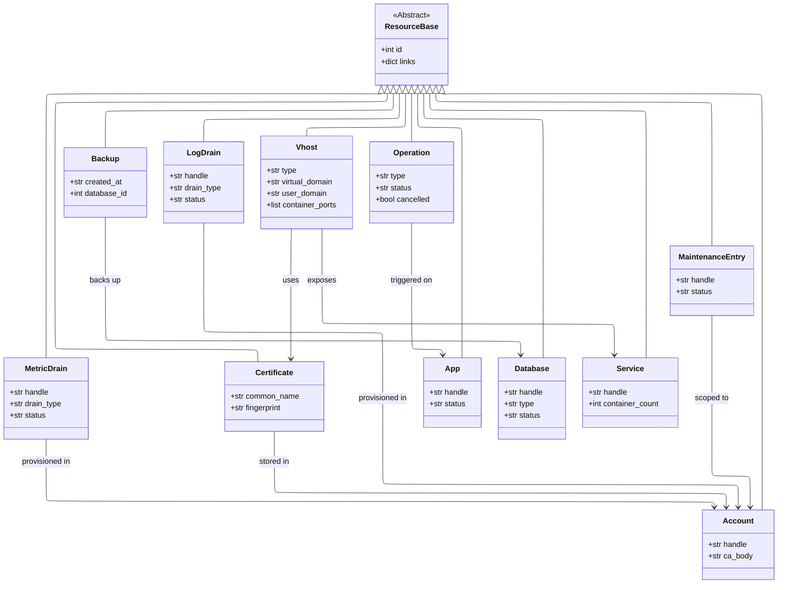
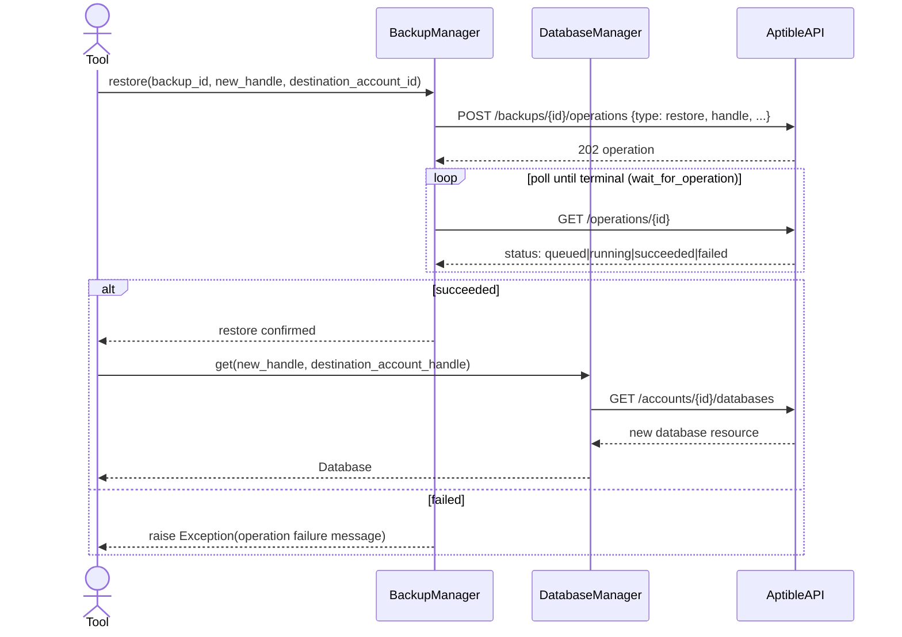

# Design: MCP–Aptible API Parity (Deploy API, Tiers 1–3)

<!-- spec-nav:start -->
**Spec navigation:** [State](00_state.md) · [Discovery](01_discovery.md) · [Requirements](02_requirements.md) · [Design](03_design.md) · [Tasks](04_tasks.md) · [Execution](05_execution.md)
<!-- spec-nav:end -->

## Overview

This design implements the 25 requirements / 78 criteria in [`02_requirements.md`](02_requirements.md)
by extending the existing `ResourceBase`/`ResourceManager` pattern
([`models/base.py`](../../models/base.py)) — Approach A from
[`01_discovery.md`](01_discovery.md#approaches-considered). It adds five new resource managers
(backups, log drains, metric drains, certificates, maintenance visibility) and extends six
existing ones (App, Database, Service, Vhost, Account, Operation), all built on one small new
shared helper that generalizes the operation-trigger-and-wait pattern already used by
`Service.scale` and `App.deploy`. No new runtime dependency is introduced, and no existing tool's
behavior or signature changes.

## Current Technology Evidence

Aptible publishes no OpenAPI/Swagger schema (confirmed in discovery: `deploy-docs.aptible.com`
redirects into the narrative docs site). Context7 (`/websites/aptible`) was queried first for
Aptible's API documentation, but returned mostly CLI-usage prose without raw request/response
JSON, so per requirements' evolving-technology constraint this design's exact request shapes are
grounded in the official open-source Aptible CLI (`github.com/aptible/aptible-cli`) and its API
client gem (`github.com/aptible/aptible-api-ruby`), cross-checked against a live unauthenticated
`GET https://api.aptible.com/` (confirms top-level collections `/accounts`, `/apps`, `/databases`,
`/database_images`, `/stacks`). The exact versions this design continues to rely on for the
HTTP/model layer are the ones already pinned in [`pyproject.toml`](../../pyproject.toml) —
`requests>=2.32.4`, `pydantic>=2.6.0` — since the Aptible Deploy API itself carries no version
identifier to select. Every shape below cites the exact CLI subcommand file it was confirmed
against. Three findings changed the requirements themselves (documented in
[02_requirements.md](02_requirements.md)'s Revision Note) rather than being absorbed silently:
database dump/execute have no server-side operation (CLI shells out to a local SSH tunnel +
`pg_dump`/`psql`), and container recovery is fully automatic with no trigger at all. **Decision:**
ground every new request shape in the CLI source citations in the table below rather than in
memory or in Context7's prose summaries. That source is treated as ground truth precisely because
no other schema is available to check it against.

| Operation | Confirmed shape | Source |
|---|---|---|
| List database backups | `GET /databases/{id}/backups` | `lib/aptible/cli/subcommands/backup.rb` |
| Restore from backup | `POST /backups/{id}/operations {"type":"restore","handle":...}` — always creates a **new** database | `backup.rb`; docs "database-backups" |
| Orphaned backups | `GET /accounts/{id}/backups?orphaned=true` (real query param) | `lib/aptible/api/account.rb` |
| Purge backup | `POST /backups/{id}/operations {"type":"purge"}` (not DELETE) | `backup.rb` |
| Create log drain | `POST /accounts/{id}/log_drains` then `POST /log_drains/{id}/operations {"type":"provision"}`; fields vary by `drain_type` (`syslog_tls_tcp`, `https_post`, `elasticsearch_database`) | `lib/aptible/cli/subcommands/log_drain.rb`, `lib/aptible/api/log_drain.rb` |
| List/deprovision log drain | List: `GET /log_drains?per_page=5000` filtered by account (CLI's actual path — `GET /accounts/{id}/log_drains` is plausible but unverified as the CLI's chosen path); Deprovision: `POST /log_drains/{id}/operations {"type":"deprovision"}` | `log_drain.rb` |
| Metric drain create/list/deprovision | Same two-step pattern; uses a nested `drain_configuration` object for most types (`influxdb`, `influxdb2`, `datadog`) | `lib/aptible/cli/subcommands/metric_drain.rb`, `lib/aptible/api/metric_drain.rb` |
| Upload certificate | `POST /accounts/{id}/certificates {"certificate_body":...,"private_key":...}` — no separate chain field; concatenate chain into `certificate_body` | `lib/aptible/api/certificate.rb`; docs "custom-certificate" |
| List certificates | `GET /accounts/{id}/certificates` | `lib/aptible/api/account.rb` |
| Custom domain + managed TLS endpoint | `POST /services/{id}/vhosts` with `{"acme": true, "user_domain": "<domain>"}` | `lib/aptible/cli/helpers/vhost/option_set_builder.rb` |
| Custom domain + own certificate | Same endpoint with `{"certificate_fingerprint": "<fp>"}` (or inline `certificate_body`/`private_key`) instead of `acme` | `option_set_builder.rb` |
| TCP/TLS/gRPC endpoint types | `POST /services/{id}/vhosts {"type": "tcp"|"tls"|"grpc"|"http", "platform": "elb"|"alb", "container_ports"/"container_port": ...}` | `lib/aptible/cli/subcommands/endpoints.rb` |
| Database endpoint | `POST /services/{id}/vhosts {"type":"tcp","platform":"elb"}` restricted to `internal`/`ip_whitelist` extras | `endpoints.rb` (`endpoints:database:create`) |
| Endpoint modify | `PUT /vhosts/{id}` with the create-time field subset minus `type`/`platform` | `endpoints.rb` |
| Endpoint TLS renewal | `POST /vhosts/{id}/operations {"type":"renew"}` — confirmed for app endpoints only | `endpoints.rb` |
| App rename | `PUT /apps/{id} {"handle":...}` | `lib/aptible/cli/subcommands/apps.rb` |
| App deploy (new image) | `POST /apps/{id}/operations {"type":"deploy","env":{...},"settings":{"APTIBLE_DOCKER_IMAGE":...},"git_ref":...}` | `lib/aptible/cli/subcommands/deploy.rb` |
| App rebuild / restart | `POST /apps/{id}/operations {"type":"rebuild"}` / `{"type":"restart"}` | `rebuild.rb`, `restart.rb` |
| Service settings | `PUT /services/{id}` with `force_zero_downtime`, `naive_health_check` (CLI flag `--simple-health-check` maps to this field name), `restart_free_scaling`, `stop_timeout` | `lib/aptible/cli/subcommands/services.rb` |
| Operation cancel | `PUT /operations/{id} {"cancelled": true}` (not DELETE, not a sub-resource) | `lib/aptible/cli/subcommands/operation.rb` |
| App one-off run | `POST /apps/{id}/operations {"type":"execute","command":...,"interactive":false}` | `lib/aptible/cli/subcommands/ssh.rb` |
| Environment rename | `PUT /accounts/{id} {"handle":...}` | `lib/aptible/cli/subcommands/environment.rb` |
| Environment CA certificate (read) | `GET /accounts/{id}` field `ca_body` | `environment.rb`, `lib/aptible/api/account.rb` |
| Database replicate | `POST /databases/{id}/operations {"type":"replicate","handle":...}` on the **source** database | `lib/aptible/cli/helpers/database.rb` |
| Database clone | `POST /databases/{id}/operations {"type":"clone","handle":...}` | `lib/aptible/cli/helpers/database.rb` |
| Database modify (IOPS/volume type) | `POST /databases/{id}/operations {"type":"modify","provisioned_iops":...,"ebs_volume_type":...}` | `lib/aptible/cli/subcommands/db.rb` |
| Database resize (size/disk/profile) | `POST /databases/{id}/operations {"type":"restart","container_size":...,"disk_size":...,"instance_profile":...}` — resize goes through `restart`, not `modify` | `db.rb` |
| Database reload / restart | `POST /databases/{id}/operations {"type":"reload"}` / `{"type":"restart"}` | `db.rb` |
| Database rename | `PUT /databases/{id} {"handle":...}` | `db.rb` |
| Database versions | `GET /database_images`, filtered client-side by `type` (already the exact endpoint the existing `list_available_types` calls) | `lib/aptible/api/database_image.rb` |
| Maintenance visibility | `GET /maintenances/apps`, `GET /maintenances/databases` (global collections, filtered client-side by account) | `lib/aptible/api/maintenance.rb` |

## Dependency Security Evidence

No new dependency applies to this design: every new manager reuses the existing `requests`-based
`AptibleApiClient` ([`api_client.py`](../../api_client.py)) and `pydantic` models already declared
in [`pyproject.toml`](../../pyproject.toml), so no additional third-party library is required and
no dependency-security audit applies here. **Decision:** ship this feature with zero new
dependencies rather than adding, for example, a crypto library for client-side certificate
validation (R7.4) — the existing convention of letting the API's own validation reject bad input
already covers it (see Components & Interfaces, `CertificateManager`).

## Architecture

New MCP tools call new or extended resource managers; every operation-triggering manager method
funnels through one new shared helper that reuses the existing `wait_for_operation`, so the HTTP
client layer (`AptibleApiClient`) is untouched. This is modeled as a flowchart rather than a block
diagram since it shows call/dependency order between layers, not just static composition; the ELK
layout engine keeps it legible given its node and edge count (dagre's default layout overlapped a
label at this size).



Source IR: [`diagrams/architecture.json`](diagrams/architecture.json).

## Data Models

New models (`Backup`, `LogDrain`, `MetricDrain`, `Certificate`, `MaintenanceEntry`) and extended
existing models all inherit `ResourceBase` exactly as today's models do.



Source IR: [`diagrams/data-models.json`](diagrams/data-models.json). `MaintenanceEntry` is one
model shared by both `maintenances/apps` and `maintenances/databases` collections, distinguished by
a `resource_type` field populated from which collection returned it — the two collections have the
same shape (`handle`, `status`, `maintenance_deadline`) per `lib/aptible/api/maintenance.rb`.

## Components & Interfaces

### Shared helper: `ResourceManager._run_operation` (new, in [`models/base.py`](../../models/base.py))

Generalizes the pattern already hand-written in `Service.scale`/`App.deploy`/`App.configure`
([`models/service.py`](../../models/service.py), [`models/app.py`](../../models/app.py)): every
new operation-triggering method that mutates *the same resource it's called on* uses this instead
of repeating the POST-then-wait-then-refetch block by hand.

```python
async def _run_operation(
    self,
    resource_id: int,
    operations_path: str,
    operation_type: str,
    extra: dict[str, Any] | None = None,
    refetch: bool = True,
) -> T | None:
    """POST {operations_path} {"type": operation_type, **extra}, wait for a terminal
    state, then optionally refetch and return resource_id's current resource."""
    operation_data = {"type": operation_type, **(extra or {})}
    response = self.api_client.post(operations_path, operation_data)
    self.api_client.wait_for_operation(response["id"])
    return await self.get_by_id(resource_id) if refetch else None
```

Actions that produce a *different* resource than the one they're called on (backup restore,
database clone/replicate) call `self.api_client.post(...)` + `wait_for_operation` directly instead
— the MCP tool composes with the target manager afterward, matching the existing composition style
in [`main.py`](../../main.py)'s `createVhost` tool (which already composes `app_manager` + `service_manager` +
`vhost_manager`).

**Consumed:** `resource_id: int`, `operations_path: str`, `operation_type: str`, `extra: dict`.
**Produced:** the refreshed resource, or `None` for actions on a resource that may no longer exist
(deprovision/purge). **Errors:** propagates `requests.exceptions.HTTPError` from a non-2xx
response, and the `Exception` `wait_for_operation` raises on a `failed` terminal status (which
already includes the API's own failure message) — this directly satisfies every requirement's
"IF the operation fails, THEN raise an error including the failure message" criterion.
**Validates: Requirements 25.1, 25.2**

### `BackupManager` (new, [`models/backup.py`](../../models/backup.py))

| Method | Signature | Behavior | Requirements |
|---|---|---|---|
| `list_for_database` | `(database_id: int, max_age: str \| None = None) -> list[Backup]` | `GET /databases/{id}/backups`; if `max_age` given, filters results client-side by `created_at` (no confirmed server-side param) | R1.1, R1.2 |
| `list_orphaned` | `(account_id: int) -> list[Backup]` | `GET /accounts/{id}/backups?orphaned=true` | R3.1 |
| `restore` | `(backup_id: int, new_handle: str, destination_account_id: int \| None = None) -> None` | `POST /backups/{id}/operations {"type":"restore","handle":...,"destination_account":...}` + wait | R2.1, R2.2 |
| `purge` | `(backup_id: int) -> None` | `POST /backups/{id}/operations {"type":"purge"}` + wait | R3.2 |

Not-found handling (R1.3, R2.3, R3.3) happens at the MCP tool layer exactly like existing tools:
`getDatabase`/`getApp` already raise before calling the manager when a handle doesn't resolve; new
tools follow the same guard.

### `LogDrainManager` / `MetricDrainManager` (new, [`models/log_drain.py`](../../models/log_drain.py), [`models/metric_drain.py`](../../models/metric_drain.py))

Both follow the identical two-step create pattern:

| Method | Signature | Behavior | Requirements |
|---|---|---|---|
| `create` | `(account_id: int, handle: str, drain_type: str, **type_fields) -> LogDrain` | `POST /accounts/{id}/log_drains`, then `_run_operation(drain.id, f"/log_drains/{drain.id}/operations", "provision")` | R4.1, R5.1 |
| `list_for_account` | `(account_id: int) -> list[LogDrain]` | `GET /accounts/{id}/log_drains` (falls back to global `GET /log_drains` filtered by account link if the nested path 404s — flagged as a verification task since the CLI itself only demonstrated the global path) | R4.2, R5.2 |
| `deprovision` | `(drain_id: int) -> None` | `_run_operation(drain_id, f"/log_drains/{drain_id}/operations", "deprovision", refetch=False)` | R4.3, R5.3 |

`drain_type` validation (R4.4, R5.4) is a static allow-list check (`syslog_tls_tcp`, `https_post`,
`elasticsearch_database` for log drains; `influxdb_database`, `influxdb`, `influxdb2`, `datadog`
for metric drains) raised before the HTTP call, mirroring `DatabaseManager.create`'s existing
image-id validation style. Not-found on deprovision (R4.5, R5.5) propagates the API's 404 as an
`HTTPError`.

### `CertificateManager` (new, [`models/certificate.py`](../../models/certificate.py))

| Method | Signature | Behavior | Requirements |
|---|---|---|---|
| `upload` | `(account_id: int, certificate_body: str, private_key: str) -> Certificate` | `POST /accounts/{id}/certificates` | R7.1, R7.4 |
| `list_for_account` | `(account_id: int) -> list[Certificate]` | `GET /accounts/{id}/certificates` | R7.3 |

R7.4 (invalid cert/key pair) is satisfied by letting the API's own validation reject the request —
this codebase's existing convention is to let `response.raise_for_status()` surface API-side
validation errors rather than re-implementing PEM/key-pair validation client-side (no new crypto
code, despite `cryptography` already being a dependency for JWT verification).

### `VhostManager` extensions (existing, [`models/vhost.py`](../../models/vhost.py))

| Method | Signature | Behavior | Requirements |
|---|---|---|---|
| `create_custom_domain` | `(service_id: int, domain: str, managed_tls: bool = True, certificate_fingerprint: str \| None = None, endpoint_type: str = "http", container_ports: list[int] \| None = None) -> Vhost` | `POST /services/{id}/vhosts` with `acme`+`user_domain` (managed TLS) or `certificate_fingerprint` (custom cert), plus `type`/`platform`/port fields per endpoint type; then `_run_operation` with `"provision"` | R6.1, R6.3, R7.2, R7.5, R8.1, R8.3 |
| `create_database_endpoint` | `(database_id: int, internal: bool = False, ip_whitelist: list[str] \| None = None) -> Vhost` | `POST` to the database's own `vhosts` relation with `{"type":"tcp","platform":"elb", ...}` — exact top-level path confirmed via the database resource's `_links.vhosts` at implementation time (HAL relation, not hardcoded, per the API's HATEOAS design noted in Current Technology Evidence) | R9.1 |
| `modify` | `(vhost_id: int, **fields) -> Vhost` | `PUT /vhosts/{vhost_id}` with the caller-supplied subset of settable fields | R10.1 |
| `renew` | `(vhost_id: int) -> Vhost` | `_run_operation(vhost_id, f"/vhosts/{vhost_id}/operations", "renew")` — app endpoints only per Current Technology Evidence | R10.2 |

`list_by_service` (existing) already returns `type` via `model_dump()`'s `extra="allow"` passthrough
on `ResourceBase`, satisfying R8.2 without a code change — only the `Vhost` model gains explicit
`type`, `user_domain`, and `container_ports` fields so callers get typed access instead of relying
on the passthrough extras.

### `AppManager` extensions (existing, [`models/app.py`](../../models/app.py))

| Method | Signature | Behavior | Requirements |
|---|---|---|---|
| `rename` | `(app_id: int, new_handle: str) -> App` | `PUT /apps/{app_id} {"handle": new_handle}` | R11.1 |
| `deploy` (extended) | `(app_id: int, docker_image: str \| None = None, git_ref: str \| None = None) -> App` | Existing method extended to accept an optional new image/ref; builds `{"type":"deploy","settings":{"APTIBLE_DOCKER_IMAGE":...}}` or `{"git_ref":...}` when provided, else the existing no-arg redeploy behavior is preserved | R12.1, R12.2 |
| `rebuild` | `(app_id: int) -> App` | `_run_operation(app_id, f"/apps/{app_id}/operations", "rebuild")` | R13.1, R13.2 |
| `restart` | `(app_id: int) -> App` | `_run_operation(app_id, f"/apps/{app_id}/operations", "restart")` | R14.1, R14.2 |
| `run_command` | `(app_id: int, command: str, interactive: bool = False) -> str` | `POST /apps/{app_id}/operations {"type":"execute","command":...}` + wait, then fetch operation output via the existing `OperationManager.logs` path | R24.1, R24.2 |

R24's requirement text names `Service_Manager` as an illustrative actor (requirements explicitly
caveat that actor names are "a behavioral grouping, not a design commitment"); Current Technology
Evidence confirms `execute` is an App-level operation, so this design places it on `AppManager`.
Rename-conflict (R11.2) and not-found (R11.3, R12.3) surface as the API's own 409/404 propagating
through `HTTPError`, exactly like existing `createApp`'s handle-uniqueness behavior.

### `ServiceManager` extensions (existing, [`models/service.py`](../../models/service.py))

| Method | Signature | Behavior | Requirements |
|---|---|---|---|
| `get_settings` | `(service_id: int) -> dict` | Returns the subset of `force_zero_downtime`, `naive_health_check`, `restart_free_scaling`, `stop_timeout` present on the `Service` resource | R15.1 |
| `update_settings` | `(service_id: int, **settings) -> Service` | `PUT /services/{service_id}` with only the four allow-listed field names; unknown keys raise before the HTTP call | R15.2, R15.3 |

### `OperationManager` extensions (existing, [`models/operation.py`](../../models/operation.py))

| Method | Signature | Behavior | Requirements |
|---|---|---|---|
| `cancel` | `(operation_id: int) -> Operation` | `PUT /operations/{operation_id} {"cancelled": true}`; raises before the call if the currently-fetched operation's `status` is already `succeeded`/`failed` | R16.1, R16.2, R16.3 |

### `AccountManager` extensions (existing, [`models/account.py`](../../models/account.py))

| Method | Signature | Behavior | Requirements |
|---|---|---|---|
| `rename` | `(account_id: int, new_handle: str) -> Account` | `PUT /accounts/{account_id} {"handle": new_handle}` | R17.1, R17.2 |
| `get_ca_certificate` | `(account_id: int) -> str \| None` | Returns the `ca_body` field from `GET /accounts/{account_id}` | R23.1 |

Not-found (R17.3, R23.2) is the existing `get_by_id`'s `None`/exception path, already exercised by
`getAccount`.

### `DatabaseManager` extensions (existing, [`models/database.py`](../../models/database.py))

| Method | Signature | Behavior | Requirements |
|---|---|---|---|
| `replicate` | `(database_id: int, replica_handle: str, container_size: int \| None = None, disk_size: int \| None = None) -> None` | `POST /databases/{database_id}/operations {"type":"replicate","handle":...}` + wait; MCP tool composes with `get(replica_handle, ...)` for the resulting resource (same composition style as backup restore) | R18.1, R18.2, R18.3 |
| `clone` | `(database_id: int, new_handle: str) -> None` | `POST /databases/{database_id}/operations {"type":"clone","handle":...}` + wait; MCP tool composes with `get(new_handle, ...)` | R19.1, R19.2, R19.3 |
| `modify_iops` | `(database_id: int, provisioned_iops: int \| None = None, ebs_volume_type: str \| None = None) -> Database` | `_run_operation(database_id, ..., "modify", {...})` | R20.1, R20.6 |
| `resize` | `(database_id: int, container_size: int \| None = None, disk_size: int \| None = None, instance_profile: str \| None = None) -> Database` | `_run_operation(database_id, ..., "restart", {...})` — resize goes through `restart` per Current Technology Evidence | R20.2, R20.6 |
| `reload` | `(database_id: int) -> Database` | `_run_operation(database_id, ..., "reload")` | R20.3, R20.6 |
| `rename` | `(database_id: int, new_handle: str) -> Database` | `PUT /databases/{database_id} {"handle": new_handle}` | R20.4, R20.7 |
| `restart` | `(database_id: int) -> Database` | `_run_operation(database_id, ..., "restart")` with no size fields | R20.5, R20.6 |
| `list_versions_for_type` | `(database_type: str) -> list[DatabaseImage]` | Filters the existing `list_available_types()` result client-side by `.type` — no new endpoint, since `list_available_types` already calls `GET /database_images` | R21.1, R21.2 |

### `MaintenanceManager` (new, read-only, [`models/maintenance.py`](../../models/maintenance.py))

| Method | Signature | Behavior | Requirements |
|---|---|---|---|
| `list_for_account` | `(account_id: int) -> list[MaintenanceEntry]` | `GET /maintenances/apps` and `GET /maintenances/databases`, each filtered client-side by account (both are global collections per Current Technology Evidence) | R22.1 |

## Key Flows

The restore-from-backup flow best illustrates the manager-composition pattern used whenever an
action produces a *different* resource than the one it's called on (also used by
`DatabaseManager.clone`/`replicate`):



Source IR: [`diagrams/flows.json`](diagrams/flows.json). Every other operation-triggering flow
(app deploy/rebuild/restart, database modify/resize/reload/restart, log/metric drain
create/deprovision, endpoint provision/renew, service settings update) follows the simpler
single-manager shape already used by `Service.scale`: tool → manager's new method →
`_run_operation` → refreshed resource back to the tool. No separate diagram is needed for those —
it would only restate the Architecture diagram's `_run_operation` box.

## New MCP Tools

Each new [`main.py`](../../main.py) tool function is a thin wrapper matching the existing style (resolve
handle(s) to id(s) via existing `getApp`/`getDatabase`/`getAccount`, call the manager method,
`.model_dump()` the result):

`listDatabaseBackups`, `restoreDatabaseFromBackup`, `listOrphanedBackups`, `purgeBackup`,
`createLogDrain`, `listLogDrains`, `deprovisionLogDrain`, `createMetricDrain`, `listMetricDrains`,
`deprovisionMetricDrain`, `uploadCertificate`, `listCertificates`, `createCustomDomainEndpoint`,
`createTypedEndpoint`, `createDatabaseEndpoint`, `modifyEndpoint`, `renewEndpoint`, `renameApp`,
`deployApp`, `rebuildApp`, `restartApp`, `getServiceSettings`, `updateServiceSettings`,
`cancelOperation`, `renameEnvironment`, `getEnvironmentCaCertificate`, `replicateDatabase`,
`cloneDatabase`, `modifyDatabaseIops`, `resizeDatabase`, `reloadDatabase`, `renameDatabase`,
`restartDatabase`, `listDatabaseVersions`, `listMaintenanceEntries`, `runAppCommand`.

## Error Handling

Every `IF <condition>, THEN raise` criterion resolves to one of three existing mechanisms — no new
error-handling machinery:

1. **Not-found / ambiguous lookup**, before any HTTP call — the same `raise Exception(f"...")`
   guard pattern already in `getApp`/`getDatabase`/`getAccount`.
2. **API-side rejection** (duplicate handle, invalid destination, 404 on an id that doesn't exist
   server-side) — `requests.Response.raise_for_status()` inside `AptibleApiClient`, already
   raising `HTTPError` for every existing tool; new tools do not swallow or reinterpret it.
3. **Operation failure** — `AptibleApiClient.wait_for_operation`'s existing `Exception(f"Operation
   {id} failed: {message}")`, reused by every `_run_operation` call and by the direct
   post-then-wait calls in `BackupManager`/`DatabaseManager`'s cross-resource actions.

## Testing Strategy

Every new/extended manager method gets a unit test in a new or existing `tests/test_<resource>.py`
file, following the exact pattern in [`tests/conftest.py`](../../tests/conftest.py) and
[`tests/test_service.py`](../../tests/test_service.py): `MagicMock(spec=AptibleApiClient)` injected
into the manager, asserting the manager calls `api_client.post`/`get`/`put` with the expected
path and body, and returns a correctly-validated Pydantic model. [`tests/test_main.py`](../../tests/test_main.py) gains one
test per new tool function verifying the handle-resolution and manager-composition wiring. `just
test` / `just typecheck` / `just lint` must stay green (existing `justfile` commands, unchanged).

## Risk Gates

| Gate | Applies? | Notes |
|---|---|---|
| Security | Yes | R7 accepts a private key as a tool argument; `CertificateManager.upload` passes it straight to `AptibleApiClient.post` (already TLS-only, already authenticated) and it is never logged — no new logging is added anywhere in this design. |
| Authorization | No new model | All new tools authenticate via the existing bearer token exactly as today's 32 tools do; no new auth surface (Auth API is explicitly deferred per discovery). |
| Privacy | N/A | No new PII is handled; certificates/CA certs are infrastructure secrets, not personal data. |
| Accessibility | N/A | No UI; MCP tool schemas only. |
| Performance | Low risk | List methods reuse the existing `per_page=5000&no_embed=true` convention; no new pagination pattern introduced. |
| Observability | Covered by existing tools | Operation failures already surface via `wait_for_operation`'s message; `getOperationLogs` (existing) covers deeper debugging for any new operation type. |
| Migration | N/A | No data migration; Aptible's API is the sole source of truth, nothing is persisted locally. |
| Rollout | Additive-only | Every new tool is a net addition; no existing tool's signature or behavior changes, so there's no flag or staged rollout to design. |
| Rollback | Trivial | Revert the commit(s) adding the new tool registrations in [`main.py`](../../main.py); no persisted state to unwind since nothing is stored outside Aptible itself. |

## Correctness Properties

1. **P1.** Listing backups for a database returns every backup with id and creation timestamp,
   filtered by max-age when requested, and raises on an unknown database handle.
   **Validates: Requirements 1.1, 1.2, 1.3**
2. **P2.** Restoring a valid backup starts a `restore` operation, waits for it, and its failure
   surfaces the operation's message; restoring an unknown backup id raises before any operation
   starts. **Validates: Requirements 2.1, 2.2, 2.3**
3. **P3.** Listing orphaned backups for an environment returns only backups whose source database
   is gone; purging a backup removes it or raises on an unknown id.
   **Validates: Requirements 3.1, 3.2, 3.3**
4. **P4.** Log drain create/list/deprovision round-trip through the two-step provision pattern; an
   unsupported `drain_type` or an unknown drain id on deprovision raises before/without a wasted
   API call. **Validates: Requirements 4.1, 4.2, 4.3, 4.4, 4.5**
5. **P5.** Metric drain create/list/deprovision behave identically to log drains, using
   `drain_configuration` for type-specific fields.
   **Validates: Requirements 5.1, 5.2, 5.3, 5.4, 5.5**
6. **P6.** Creating a custom-domain endpoint with managed TLS provisions it and returns DNS
   validation records; an unknown service or an unsupported apex domain raises before
   provisioning. **Validates: Requirements 6.1, 6.2, 6.3**
7. **P7.** Uploading a certificate stores it and returns its fingerprint; creating an endpoint
   against a stored fingerprint succeeds, listing certificates returns them all, and an invalid
   pair or unknown fingerprint raises. **Validates: Requirements 7.1, 7.2, 7.3, 7.4, 7.5**
8. **P8.** Creating a TCP/TLS/gRPC endpoint provisions the requested type bound to the given
   ports; listing endpoints surfaces each one's type; a TLS endpoint without a certificate raises
   before provisioning. **Validates: Requirements 8.1, 8.2, 8.3**
9. **P9.** Creating a database endpoint for a valid handle provisions it and returns its
   hostname/port; an unknown handle raises before provisioning.
   **Validates: Requirements 9.1, 9.2**
10. **P10.** Modifying an endpoint's settings applies the change; renewing an app endpoint's
    managed TLS starts and resolves a `renew` operation; an unknown endpoint id raises before
    either action. **Validates: Requirements 10.1, 10.2, 10.3**
11. **P11.** Renaming an app to a unique handle applies it; a duplicate handle or unknown app
    raises instead. **Validates: Requirements 11.1, 11.2, 11.3**
12. **P12.** Deploying a new image to an app starts and resolves a `deploy` operation; its failure
    surfaces the operation message, and an unknown app raises before the deploy starts.
    **Validates: Requirements 12.1, 12.2, 12.3**
13. **P13.** Rebuilding an app starts and resolves a `rebuild` operation; failure surfaces the
    operation message. **Validates: Requirements 13.1, 13.2**
14. **P14.** Restarting an app starts and resolves a `restart` operation; failure surfaces the
    operation message. **Validates: Requirements 14.1, 14.2**
15. **P15.** Reading a service's settings returns current values; updating supported settings
    applies them; an unsupported setting name raises before any change is applied.
    **Validates: Requirements 15.1, 15.2, 15.3**
16. **P16.** Cancelling a queued/running operation requests cancellation and returns its status;
    cancelling a terminal or unknown operation raises instead.
    **Validates: Requirements 16.1, 16.2, 16.3**
17. **P17.** Renaming an environment to a unique handle applies it; a duplicate handle or unknown
    environment raises instead. **Validates: Requirements 17.1, 17.2, 17.3**
18. **P18.** Replicating a database starts and resolves a `replicate` operation, and the tool
    layer returns the resulting replica; failure or an unknown source database raises.
    **Validates: Requirements 18.1, 18.2, 18.3**
19. **P19.** Cloning a database starts and resolves a `clone` operation, and the tool layer
    returns the resulting new database; failure or a duplicate target handle raises.
    **Validates: Requirements 19.1, 19.2, 19.3**
20. **P20.** Modify/resize/reload/rename/restart on a database each apply their respective change
    via the correct operation type (or `PUT` for rename) and return the updated resource; any
    operation failure or a duplicate rename handle raises.
    **Validates: Requirements 20.1, 20.2, 20.3, 20.4, 20.5, 20.6, 20.7**
21. **P21.** Listing versions for a known database type returns its supported versions, filtered
    from the existing database-images list; an unknown type raises instead of returning an empty
    list. **Validates: Requirements 21.1, 21.2**
22. **P22.** Listing maintenance entries for an environment returns apps/databases currently in
    maintenance mode; an unknown environment raises instead of returning an empty list.
    **Validates: Requirements 22.1, 22.2**
23. **P23.** Reading an environment's CA certificate returns it when configured; an unknown
    environment raises instead. **Validates: Requirements 23.1, 23.2**
24. **P24.** Running a one-off command against an app's service starts an `execute` operation and
    returns its captured output; failure surfaces the output and message, and an unknown
    app/service raises before the operation starts.
    **Validates: Requirements 24.1, 24.2, 24.3**
25. **P25.** Every operation-triggering tool in this design waits for the underlying Aptible
    operation to reach a terminal state (via `_run_operation` or a direct `wait_for_operation`
    call) before returning, and raises rather than returning an ambiguous partial result if it
    does not. **Validates: Requirements 25.1, 25.2**

## Residual Uncertainty (to verify during implementation, not invented here)

- Exact `Backup` resource fields beyond `created_at` (e.g. size, type) — not critical to any
  criterion above, but should be captured in the `Backup` Pydantic model as discovered.
- Whether `GET /accounts/{id}/log_drains`/`metric_drains` (the account-nested path) works, or
  whether listing must go through the global collection filtered client-side — `list_for_account`
  is designed to try the nested path first and fall back, but this fallback itself should be
  covered by a task-level integration check against a real (or sandboxed) Aptible account before
  Tier 1 ships.
- The exact HAL relation/path for `create_database_endpoint` — confirmed to exist, not confirmed
  as a literal path independent of following the database resource's own `_links`.

## Approval

Status: **Approved on 2026-08-12** — 5 new managers, 6 extended managers, 1 shared helper, and
25 correctness properties covering all 78 criteria accepted as written. Proceeding to tasks.
