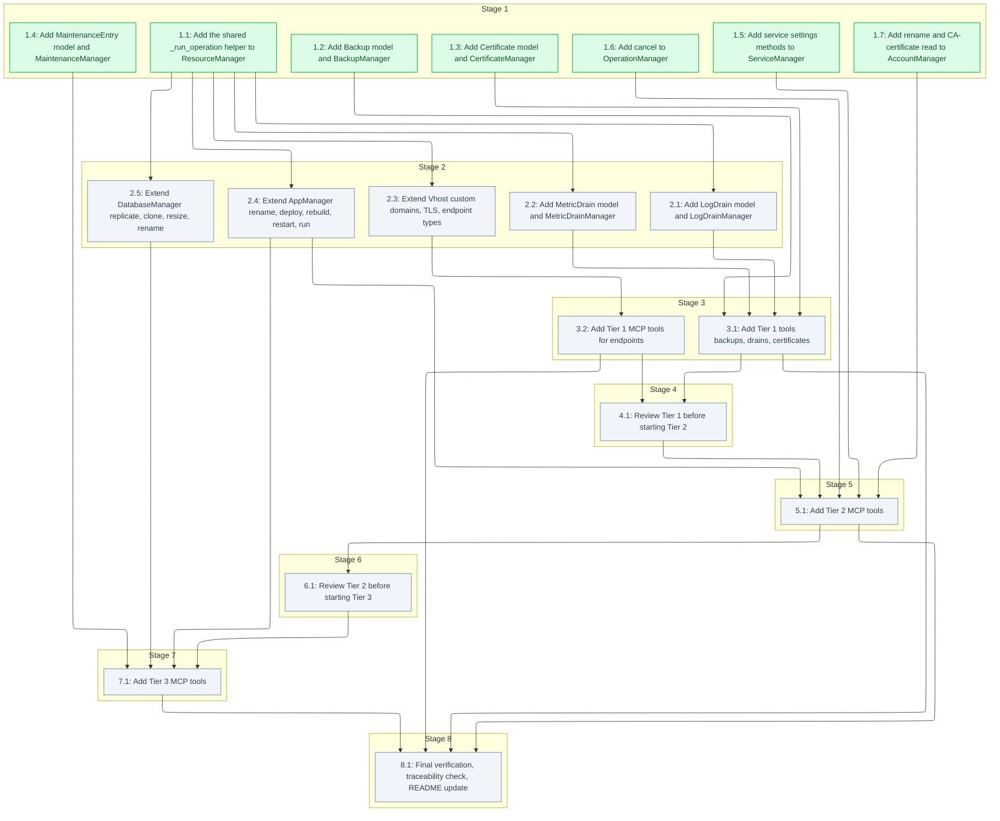

# Tasks: MCP–Aptible API Parity (Deploy API, Tiers 1–3)

<!-- spec-nav:start -->
**Spec navigation:** [State](00_state.md) · [Discovery](01_discovery.md) · [Requirements](02_requirements.md) · [Design](03_design.md) · [Tasks](04_tasks.md) · [Execution](05_execution.md)
<!-- spec-nav:end -->

## Stage and Dependency Overview

> [!WARNING]
> Execute dependency stages in order. Run tasks concurrently only when each is marked
> `parallel-safe`, their ownership is disjoint, and isolated worktrees are available. Stop at
> every checkpoint for human review.

- [x] 1. Foundational resource managers (Stage 1 — no dependencies, disjoint files)
  - [x] 1.1 Add the shared `_run_operation` helper to `ResourceManager`
    - Add `async def _run_operation(self, resource_id, operations_path, operation_type, extra=None, refetch=True)` to `ResourceManager` exactly per the design's Components & Interfaces section: POST `operations_path` with `{"type": operation_type, **(extra or {})}`, call `self.api_client.wait_for_operation(response["id"])`, then return `await self.get_by_id(resource_id)` if `refetch` else `None`.
    - Add a docstring explaining the contract (POST-wait-refetch) and why it exists (generalizes the pattern already hand-written in `Service.scale`/`App.deploy`/`App.configure`).
    - **Files:** [`models/base.py`](../../models/base.py), [`tests/test_base.py`](../../tests/test_base.py)
    - **Dependency resolution:** none
    - **Dependency delivery:** none
    - **Depends on:** none
    - **Stage:** 1
    - **Interfaces:** Consumes: `AptibleApiClient.post`/`wait_for_operation`/`ResourceManager.get_by_id` (all existing, unchanged); Produces: `ResourceManager._run_operation(resource_id: int, operations_path: str, operation_type: str, extra: dict | None = None, refetch: bool = True) -> T | None`, reused by every Stage 2+ manager method that triggers an operation on its own resource.
    - **Documentation:** public API/module comments required; docstring states the POST-wait-refetch contract and the existing methods it generalizes.
    - **Verification:** New [`tests/test_base.py`](../../tests/test_base.py) covers: refetch path returns the resource, `refetch=False` returns `None`, and a failed operation propagates `wait_for_operation`'s exception. Run `just test`, `just typecheck`, `just lint`.
    - **Estimated effort:** 30-45 minutes
    - **Risk:** low; purely additive method, no existing call site changes
    - **Task category:** code_analysis
    - **Delegation:** parallel-safe
    - _Requirements: 25.1, 25.2_
  - [x] 1.2 Add `Backup` model and `BackupManager`
    - Create `Backup(ResourceBase)` with `created_at: str` and a `database_id` computed field (mirroring `Database.account_id`'s `_links` extraction pattern).
    - Create `BackupManager` with `list_for_database(database_id, max_age=None)` (`GET /databases/{id}/backups?per_page=5000&no_embed=true`, matching the `?per_page=5000&no_embed=true` convention every existing custom list method uses (see `ServiceManager.list_by_app`), then client-side filter by `created_at` if `max_age` given), `list_orphaned(account_id)` (`GET /accounts/{id}/backups?orphaned=true&per_page=5000&no_embed=true`), `restore(backup_id, new_handle, destination_account_id=None)` (`POST /backups/{id}/operations {"type":"restore","handle":...}`, including the destination-account field in the body when `destination_account_id` is given — confirm the exact field name live per this task's verification checklist item, then `wait_for_operation`, no refetch — the tool layer composes with `DatabaseManager.get` afterward), `purge(backup_id)` (`POST /backups/{id}/operations {"type":"purge"}` + wait).
    - **Files:** [`models/backup.py`](../../models/backup.py), [`tests/test_backup.py`](../../tests/test_backup.py), [`models/__init__.py`](../../models/__init__.py)
    - **Dependency resolution:** none
    - **Dependency delivery:** none
    - **Depends on:** none
    - **Stage:** 1
    - **Interfaces:** Consumes: `AptibleApiClient.get`/`post`/`wait_for_operation` (existing); Produces: `Backup` model and `BackupManager.{list_for_database, list_orphaned, restore, purge}`, exported from [`models/__init__.py`](../../models/__init__.py) for Stage 3 tool tasks to import.
    - **Documentation:** public API/module comments required; each manager method's docstring cites its confirmed request shape from the design's Current Technology Evidence table.
    - **Verification:** New [`tests/test_backup.py`](../../tests/test_backup.py) mocks `AptibleApiClient` (per [`tests/test_service.py`](../../tests/test_service.py)'s pattern) and asserts each method's exact path/body and return type. Confirm live against the Aptible API/CLI: the exact destination-account field name on restore, and the exact `_links` key a backup resource uses for its parent database (assumed `links.database.href` for the `database_id` computed field) — update the field name in code if either differs from this assumption. Run `just test`, `just typecheck`, `just lint`.
    - **Estimated effort:** 60-90 minutes
    - **Risk:** low; new file, no existing behavior touched
    - **Task category:** code_analysis
    - **Delegation:** sequential subagent
    - _Requirements: 1.1, 1.2, 1.3, 2.1, 2.2, 2.3, 3.1, 3.2, 3.3_
  - [x] 1.3 Add `Certificate` model and `CertificateManager`
    - Create `Certificate(ResourceBase)` with `common_name: str | None` and `fingerprint: str | None`.
    - Create `CertificateManager` with `upload(account_id, certificate_body, private_key)` (`POST /accounts/{id}/certificates`) and `list_for_account(account_id)` (`GET /accounts/{id}/certificates?per_page=5000&no_embed=true`, matching the pagination convention every existing custom list method uses). Do not add client-side PEM/key-pair validation — let the API's own rejection surface as `HTTPError` (per design's Dependency Security Evidence decision).
    - **Files:** [`models/certificate.py`](../../models/certificate.py), [`tests/test_certificate.py`](../../tests/test_certificate.py), [`models/__init__.py`](../../models/__init__.py)
    - **Dependency resolution:** none
    - **Dependency delivery:** none
    - **Depends on:** none
    - **Stage:** 1
    - **Interfaces:** Consumes: `AptibleApiClient.get`/`post` (existing); Produces: `Certificate` model and `CertificateManager.{upload, list_for_account}`.
    - **Documentation:** public API/module comments required; docstring on `upload` notes that no chain field exists — intermediate certs must be concatenated into `certificate_body` by the caller.
    - **Verification:** New [`tests/test_certificate.py`](../../tests/test_certificate.py) mocks `AptibleApiClient`, asserts request body shape, and asserts an `HTTPError` from a mocked 422 response propagates unmodified. Confirm `private_key` never appears in any log statement (there should be none). Confirm live that certificate responses actually include `common_name` and `fingerprint` under those exact field names. Run `just test`, `just typecheck`, `just lint`.
    - **Estimated effort:** 30-45 minutes
    - **Risk:** medium; handles a private key as a plain argument — verify no logging path exists
    - **Task category:** code_analysis
    - **Delegation:** sequential subagent
    - _Requirements: 7.1, 7.3, 7.4_
  - [x] 1.4 Add `MaintenanceEntry` model and `MaintenanceManager`
    - Create `MaintenanceEntry(ResourceBase)` with `handle: str`, `status: str`, and a `resource_type` field set by the manager to `"app"` or `"database"` depending on which collection returned it.
    - Create `MaintenanceManager` with `list_for_account(account_id)`: `GET /maintenances/apps?per_page=5000&no_embed=true` and `GET /maintenances/databases?per_page=5000&no_embed=true` (both global collections per design, paginated per the existing custom-list convention), filter each client-side by account, tag with `resource_type`, and merge into one list.
    - **Files:** [`models/maintenance.py`](../../models/maintenance.py), [`tests/test_maintenance.py`](../../tests/test_maintenance.py), [`models/__init__.py`](../../models/__init__.py)
    - **Dependency resolution:** none
    - **Dependency delivery:** none
    - **Depends on:** none
    - **Stage:** 1
    - **Interfaces:** Consumes: `AptibleApiClient.get` (existing); Produces: `MaintenanceEntry` model and `MaintenanceManager.list_for_account(account_id: int) -> list[MaintenanceEntry]`.
    - **Documentation:** public API/module comments required; docstring notes both source collections are global and filtered client-side.
    - **Verification:** New [`tests/test_maintenance.py`](../../tests/test_maintenance.py) mocks two separate `GET` responses and asserts client-side account filtering and `resource_type` tagging. Confirm live the actual response fields for `/maintenances/apps`/`/maintenances/databases` and which field identifies the owning account for client-side filtering (assumed `account`/`_links.account`, matching every other resource's pattern). Run `just test`, `just typecheck`, `just lint`.
    - **Estimated effort:** 30-45 minutes
    - **Risk:** low
    - **Task category:** code_analysis
    - **Delegation:** sequential subagent
    - _Requirements: 22.1, 22.2_
  - [x] 1.5 Add service settings methods to `ServiceManager`
    - Add `get_settings(service_id)` returning the current values of `force_zero_downtime`, `naive_health_check`, `restart_free_scaling`, `stop_timeout` from the fetched `Service` resource.
    - Add `update_settings(service_id, **settings)`: validate every key against the same four-name allow-list (raise `ValueError` naming the unsupported key before any HTTP call), then `PUT /services/{id}` with only the supplied fields.
    - **Files:** [`models/service.py`](../../models/service.py), [`tests/test_service.py`](../../tests/test_service.py)
    - **Dependency resolution:** none
    - **Dependency delivery:** none
    - **Depends on:** none
    - **Stage:** 1
    - **Interfaces:** Consumes: `AptibleApiClient.get`/`put` (existing); Produces: `ServiceManager.{get_settings, update_settings}`.
    - **Documentation:** public API/module comments required; docstring notes the `--simple-health-check` CLI flag maps to the `naive_health_check` field name.
    - **Verification:** Extend [`tests/test_service.py`](../../tests/test_service.py) with cases for both methods, including the unsupported-setting-name rejection. Confirm live that `GET /services/{id}` actually returns `force_zero_downtime`, `naive_health_check`, `restart_free_scaling`, and `stop_timeout`. Run `just test`, `just typecheck`, `just lint`.
    - **Estimated effort:** 30-45 minutes
    - **Risk:** low
    - **Task category:** code_analysis
    - **Delegation:** parallel-safe
    - _Requirements: 15.1, 15.2, 15.3_
  - [x] 1.6 Add `cancel` to `OperationManager`
    - Add `status: str` and `cancelled: bool = False` fields to `Operation` (currently relies on `ResourceBase`'s `extra="allow"` passthrough for these; make them explicit since `cancel()`'s own logic reads `status`).
    - Add `cancel(operation_id)`: fetch the operation, raise if its `status` is already `succeeded`/`failed` (naming the id), else `PUT /operations/{id} {"cancelled": true}` and return the updated `Operation`.
    - **Files:** [`models/operation.py`](../../models/operation.py), [`tests/test_operation.py`](../../tests/test_operation.py)
    - **Dependency resolution:** none
    - **Dependency delivery:** none
    - **Depends on:** none
    - **Stage:** 1
    - **Interfaces:** Consumes: `AptibleApiClient.get`/`put` (existing); Produces: `OperationManager.cancel(operation_id: int) -> Operation`.
    - **Documentation:** public API/module comments required; docstring notes cancellation is a `PUT` with `cancelled: true`, not a `DELETE` or sub-resource.
    - **Verification:** New [`tests/test_operation.py`](../../tests/test_operation.py) covers cancelling a `running` operation, rejecting a `succeeded` one, and an unknown id. Run `just test`, `just typecheck`, `just lint`.
    - **Estimated effort:** 20-30 minutes
    - **Risk:** low
    - **Task category:** code_analysis
    - **Delegation:** parallel-safe
    - _Requirements: 16.1, 16.2, 16.3_
  - [x] 1.7 Add rename and CA-certificate read to `AccountManager`
    - Add `rename(account_id, new_handle)`: `PUT /accounts/{id} {"handle": new_handle}`, letting a duplicate-handle rejection propagate as `HTTPError`.
    - Add `get_ca_certificate(account_id)`: `GET /accounts/{id}`, return the `ca_body` field (or `None`).
    - **Files:** [`models/account.py`](../../models/account.py), [`tests/test_account.py`](../../tests/test_account.py)
    - **Dependency resolution:** none
    - **Dependency delivery:** none
    - **Depends on:** none
    - **Stage:** 1
    - **Interfaces:** Consumes: `AptibleApiClient.get`/`put` (existing); Produces: `AccountManager.{rename, get_ca_certificate}`.
    - **Documentation:** public API/module comments required; docstring on `get_ca_certificate` notes the write path is unconfirmed and intentionally not implemented (per design's Residual Uncertainty).
    - **Verification:** Extend [`tests/test_account.py`](../../tests/test_account.py) with rename (success + duplicate-handle) and CA-certificate-read (configured + unconfigured) cases. Confirm live that `GET /accounts/{id}` returns `ca_body` (and whether it's `null` or simply absent when unconfigured, so `get_ca_certificate` handles both). Run `just test`, `just typecheck`, `just lint`.
    - **Estimated effort:** 30-45 minutes
    - **Risk:** low
    - **Task category:** code_analysis
    - **Delegation:** parallel-safe
    - _Requirements: 17.1, 17.2, 17.3, 23.1, 23.2_

- [ ] 2. Manager extensions using the shared operation helper (Stage 2)
  - [ ] 2.1 Add `LogDrain` model and `LogDrainManager`
    - Create `LogDrain(ResourceBase)` with `handle: str`, `drain_type: str`, `status: str`.
    - Create `LogDrainManager` with `create(account_id, handle, drain_type, **type_fields)` (validate `drain_type` against `{"syslog_tls_tcp", "https_post", "elasticsearch_database"}` before any call; `POST /accounts/{id}/log_drains`, then `self._run_operation(drain.id, f"/log_drains/{drain.id}/operations", "provision")`), `list_for_account(account_id)` (try `GET /accounts/{id}/log_drains?per_page=5000&no_embed=true`; on a 404 `HTTPError`, fall back to `GET /log_drains?per_page=5000` filtered client-side by the drain's account link — this resolves the design's flagged Residual Uncertainty), `deprovision(drain_id)` (`self._run_operation(drain_id, f"/log_drains/{drain_id}/operations", "deprovision", refetch=False)`).
    - **Files:** `models/log_drain.py`, `tests/test_log_drain.py`, [`models/__init__.py`](../../models/__init__.py)
    - **Dependency resolution:** none
    - **Dependency delivery:** none
    - **Depends on:** 1.1
    - **Stage:** 2
    - **Interfaces:** Consumes: `ResourceManager._run_operation` (task 1.1); Produces: `LogDrain` model and `LogDrainManager.{create, list_for_account, deprovision}`.
    - **Documentation:** public API/module comments required; docstring on `list_for_account` documents the nested-path-then-fallback behavior and why (unconfirmed CLI path).
    - **Verification:** New `tests/test_log_drain.py` covers create (valid + unsupported type), list (nested-path success, and fallback triggered by a mocked 404), and deprovision (success + unknown id). Run `just test`, `just typecheck`, `just lint`.
    - **Estimated effort:** 60-90 minutes
    - **Risk:** medium; the account-nested list path is unconfirmed against a real API — verify the fallback branch is actually exercised by a test, not just written
    - **Task category:** code_analysis
    - **Delegation:** sequential subagent
    - _Requirements: 4.1, 4.2, 4.3, 4.4, 4.5_
  - [ ] 2.2 Add `MetricDrain` model and `MetricDrainManager`
    - Create `MetricDrain(ResourceBase)` with `handle: str`, `drain_type: str`, `status: str`.
    - Create `MetricDrainManager` mirroring `LogDrainManager`'s shape: `create(account_id, handle, drain_type, drain_configuration=None, **type_fields)` (validate `drain_type` against `{"influxdb_database", "influxdb", "influxdb2", "datadog"}`; `POST /accounts/{id}/metric_drains`, then `self._run_operation(drain.id, f"/metric_drains/{drain.id}/operations", "provision")`), `list_for_account(account_id)` (same nested-path-then-global-fallback pattern as log drains), `deprovision(drain_id)` (`self._run_operation(..., "deprovision", refetch=False)`).
    - **Files:** `models/metric_drain.py`, `tests/test_metric_drain.py`, [`models/__init__.py`](../../models/__init__.py)
    - **Dependency resolution:** none
    - **Dependency delivery:** none
    - **Depends on:** 1.1
    - **Stage:** 2
    - **Interfaces:** Consumes: `ResourceManager._run_operation` (task 1.1); Produces: `MetricDrain` model and `MetricDrainManager.{create, list_for_account, deprovision}`.
    - **Documentation:** public API/module comments required; docstring notes `drain_configuration` is a nested object for most types, unlike log drains' flat fields.
    - **Verification:** New `tests/test_metric_drain.py` mirrors task 2.1's test cases for the metric-drain shape. Run `just test`, `just typecheck`, `just lint`.
    - **Estimated effort:** 60-90 minutes
    - **Risk:** medium; same unconfirmed-list-path caveat as task 2.1
    - **Task category:** code_analysis
    - **Delegation:** sequential subagent
    - _Requirements: 5.1, 5.2, 5.3, 5.4, 5.5_
  - [ ] 2.3 Extend `Vhost`: custom domains, TLS, endpoint types
    - Add `type: str | None = Field(None, ...)`, `user_domain: str | None = Field(None, ...)`, and `container_ports: list[int] | None = Field(None, ...)` fields to `Vhost`, matching the existing `virtual_domain: str | None` convention exactly — **not** required fields, since every existing fixture/response (including today's default on-aptible.com vhosts) lacks them and `model_validate` would otherwise reject them. This is a typed-access improvement over `ResourceBase`'s `extra="allow"` passthrough, not new data.
    - Add `create_custom_domain(service_id, domain, managed_tls=True, certificate_fingerprint=None, endpoint_type="http", container_ports=None)`: build the `POST /services/{id}/vhosts` body per design (managed TLS → `acme`+`user_domain`; custom cert → `certificate_fingerprint`; type-specific port fields), then `self._run_operation(vhost.id, f"/vhosts/{vhost.id}/operations", "provision")`. Raise before the call if `endpoint_type == "tls"` and no certificate reference is supplied.
    - Add `create_database_endpoint(database_id, internal=False, ip_whitelist=None)`: resolve the database's own `vhosts` HAL relation (fetch the database resource, read `links["vhosts"]["href"]`) rather than hardcoding a path, `POST` `{"type":"tcp","platform":"elb", ...}`, then provision — this resolves the design's flagged Residual Uncertainty about the exact path.
    - Add `modify(vhost_id, **fields)`: `PUT /vhosts/{vhost_id}` with the caller-supplied field subset.
    - Add `renew(vhost_id)`: `self._run_operation(vhost_id, f"/vhosts/{vhost_id}/operations", "renew")`.
    - **Files:** [`models/vhost.py`](../../models/vhost.py), [`tests/test_vhost.py`](../../tests/test_vhost.py)
    - **Dependency resolution:** none
    - **Dependency delivery:** none
    - **Depends on:** 1.1
    - **Stage:** 2
    - **Interfaces:** Consumes: `ResourceManager._run_operation` (task 1.1); Produces: `VhostManager.{create_custom_domain, create_database_endpoint, modify, renew}`, extended `Vhost` model.
    - **Documentation:** public API/module comments required; docstring on `create_database_endpoint` explains the HAL-relation resolution and why (no stable hardcoded path was confirmed).
    - **Verification:** Extend [`tests/test_vhost.py`](../../tests/test_vhost.py) with cases for managed-TLS creation, custom-cert creation, each endpoint type (including the missing-certificate rejection for `tls`), database-endpoint creation (mocking the database's `_links.vhosts`), modify, and renew. Run `just test`, `just typecheck`, `just lint`.
    - **Estimated effort:** 90-150 minutes
    - **Risk:** medium; resolves two of the design's three flagged Residual Uncertainty items (database-endpoint path, apex-domain rejection) — treat the HAL-relation resolution as the riskiest sub-step and test it explicitly
    - **Task category:** heavy_reasoning
    - **Delegation:** parallel-safe
    - _Requirements: 6.1, 6.2, 6.3, 7.2, 7.5, 8.1, 8.2, 8.3, 9.1, 9.2, 10.1, 10.2, 10.3_
  - [ ] 2.4 Extend `AppManager`: rename, deploy, rebuild, restart, run
    - Add `rename(app_id, new_handle)`: `PUT /apps/{id} {"handle": new_handle}`.
    - Extend the existing `deploy(app_id, docker_image=None, git_ref=None)`: when `docker_image` or `git_ref` is supplied, include `settings`/`git_ref` in the operation body per design; preserve today's no-arg redeploy behavior when neither is given. Change its return type from `None` to `App` (refetch via `self.get_by_id(app_id)` after `wait_for_operation`, matching `_run_operation`'s shape) — every existing call site (`createApp` in [`main.py`](../../main.py), which calls `deploy(app.id)` with no args and discards the return) is unaffected by this since Python allows ignoring a return value; only add the return, don't change any caller.
    - Add `rebuild(app_id)` and `restart(app_id)`: each `self._run_operation(app_id, f"/apps/{app_id}/operations", "rebuild"|"restart")`.
    - Add `run_command(app_id, command, interactive=False)`: `POST /apps/{app_id}/operations {"type":"execute","command":...,"interactive":...}` + `wait_for_operation`, then lazily construct `OperationManager(self.api_client)` (same lazy-construction pattern `AccountManager.create` already uses for `StackManager`) and call its `.logs(operation_id)` to fetch and return the operation's output — `AppManager` has no existing reference to an `OperationManager` instance, so this construction is required, not optional.
    - **Files:** [`models/app.py`](../../models/app.py), [`tests/test_app.py`](../../tests/test_app.py)
    - **Dependency resolution:** none
    - **Dependency delivery:** none
    - **Depends on:** 1.1
    - **Stage:** 2
    - **Interfaces:** Consumes: `ResourceManager._run_operation` (task 1.1), existing `OperationManager.logs`; Produces: `AppManager.{rename, rebuild, restart, run_command}` and extended `deploy`.
    - **Documentation:** public API/module comments required; docstring on `run_command` notes this design places `execute` on `AppManager` (not `ServiceManager`) per the design's Current Technology Evidence, despite Requirement 24's illustrative actor name.
    - **Verification:** Extend [`tests/test_app.py`](../../tests/test_app.py) with rename (success + duplicate handle), deploy (new-image path + unchanged no-arg path), rebuild, restart, and run_command (success + failure with captured output). Run `just test`, `just typecheck`, `just lint`.
    - **Estimated effort:** 90-120 minutes
    - **Risk:** low; extends an existing method carefully to avoid changing its current no-arg behavior — verify the existing `createApp` call path (which uses `deploy(app_id)` with no args) still passes unchanged
    - **Task category:** code_analysis
    - **Delegation:** parallel-safe
    - _Requirements: 11.1, 11.2, 11.3, 12.1, 12.2, 12.3, 13.1, 13.2, 14.1, 14.2, 24.1, 24.2, 24.3_
  - [ ] 2.5 Extend `DatabaseManager`: replicate, clone, resize, rename
    - Fix a pre-existing bug while touching this class: `delete()` currently does `await self.api_client.wait_for_operation(...)` ([`models/database.py`](../../models/database.py):133, with a `# type: ignore[func-returns-value]` masking it), but `wait_for_operation` is a synchronous method returning `None` — this raises `TypeError` against the real client and is only hidden because its test mocks the call with `AsyncMock` instead of `MagicMock` (unlike every other manager's tests). Remove the `await` and the `type: ignore`, and fix the corresponding test in [`tests/test_database.py`](../../tests/test_database.py) to mock with `MagicMock()`. Write every new method below using the correct non-awaited pattern from the start so this bug isn't copied.
    - Add `replicate(database_id, replica_handle, container_size=None, disk_size=None)` and `clone(database_id, new_handle)`: each `POST /databases/{database_id}/operations {"type":"replicate"|"clone", ...}` + `wait_for_operation`, no refetch (tool layer composes with `get(new_handle, ...)`).
    - Add `modify_iops(database_id, provisioned_iops=None, ebs_volume_type=None)` and `reload(database_id)` and `restart(database_id)`: each `self._run_operation(database_id, f"/databases/{database_id}/operations", "modify"|"reload"|"restart", extra)`.
    - Add `resize(database_id, container_size=None, disk_size=None, instance_profile=None)`: `self._run_operation(database_id, ..., "restart", {"container_size":..., "disk_size":..., "instance_profile":...})` — resize goes through the `restart` operation type per design, not `modify`.
    - Add `rename(database_id, new_handle)`: `PUT /databases/{database_id} {"handle": new_handle}`.
    - Add `list_versions_for_type(database_type)`: call the existing `list_available_types()` and filter the result client-side by `.type` — no new endpoint.
    - **Files:** [`models/database.py`](../../models/database.py), [`tests/test_database.py`](../../tests/test_database.py)
    - **Dependency resolution:** none
    - **Dependency delivery:** none
    - **Depends on:** 1.1
    - **Stage:** 2
    - **Interfaces:** Consumes: `ResourceManager._run_operation` (task 1.1), existing `list_available_types`; Produces: `DatabaseManager.{replicate, clone, modify_iops, resize, reload, rename, restart, list_versions_for_type}`.
    - **Documentation:** public API/module comments required; docstring on `resize` explicitly calls out that it uses the `restart` operation type, not `modify`, since that's a non-obvious API quirk this design deliberately preserves.
    - **Verification:** Extend [`tests/test_database.py`](../../tests/test_database.py) with one case per new method (success + a representative failure/not-found path each) and a `list_versions_for_type` case confirming no new HTTP call beyond the existing `/database_images` fetch. Run `just test`, `just typecheck`, `just lint`.
    - **Estimated effort:** 90-150 minutes
    - **Risk:** low; all shapes are fully confirmed in the design, no residual uncertainty here
    - **Task category:** code_analysis
    - **Delegation:** parallel-safe
    - _Requirements: 18.1, 18.2, 18.3, 19.1, 19.2, 19.3, 20.1, 20.2, 20.3, 20.4, 20.5, 20.6, 20.7, 21.1, 21.2_

- [ ] 3. Tier 1 MCP tools — backups, drains, certificates, endpoints
  - [ ] 3.1 Add Tier 1 tools: backups, drains, certificates
    - Add [`main.py`](../../main.py) tools: `listDatabaseBackups`, `restoreDatabaseFromBackup` (composes `backup_manager.restore` + `database_manager.get` for the resulting database, per the design's Key Flows sequence), `listOrphanedBackups`, `purgeBackup`, `createLogDrain`, `listLogDrains`, `deprovisionLogDrain`, `createMetricDrain`, `listMetricDrains`, `deprovisionMetricDrain`, `uploadCertificate`, `listCertificates`. Each resolves handle(s) via existing `getApp`/`getDatabase`/`getAccount` helpers exactly like existing tools, calls the manager, and `.model_dump()`s the result.
    - Instantiate `backup_manager`, `log_drain_manager`, `metric_drain_manager`, `certificate_manager` alongside the existing manager instances at module scope.
    - **Files:** [`main.py`](../../main.py), [`tests/test_main.py`](../../tests/test_main.py)
    - **Dependency resolution:** none
    - **Dependency delivery:** none
    - **Depends on:** 1.2, 1.3, 2.1, 2.2
    - **Stage:** 3
    - **Interfaces:** Consumes: `BackupManager` (1.2), `CertificateManager` (1.3), `LogDrainManager` (2.1), `MetricDrainManager` (2.2), existing `getApp`/`getDatabase`/`getAccount`; Produces: the 12 named `@mcp.tool()` functions above, registered on the module-level `mcp` instance.
    - **Documentation:** public API/module comments required; each tool's docstring matches the existing one-paragraph style (see `getDatabase` in [`main.py`](../../main.py)) stating what it does and any handle-disambiguation behavior.
    - **Verification:** Extend [`tests/test_main.py`](../../tests/test_main.py) with one case per tool verifying correct manager composition and handle resolution (mocking the managers, not the HTTP layer). Run `just test`, `just typecheck`, `just lint`.
    - **Estimated effort:** 90-150 minutes
    - **Risk:** low; thin wrappers over already-tested managers
    - **Task category:** code_analysis
    - **Delegation:** controller
    - _Requirements: 1.1, 1.2, 1.3, 2.1, 2.2, 2.3, 3.1, 3.2, 3.3, 4.1, 4.2, 4.3, 4.4, 4.5, 5.1, 5.2, 5.3, 5.4, 5.5, 7.1, 7.3, 7.4_
  - [ ] 3.2 Add Tier 1 MCP tools for endpoints
    - Add [`main.py`](../../main.py) tools: `createCustomDomainEndpoint`, `createTypedEndpoint`, `createDatabaseEndpoint`, `modifyEndpoint`, `renewEndpoint`, following the same thin-wrapper style as task 3.1.
    - **Files:** [`main.py`](../../main.py), [`tests/test_main.py`](../../tests/test_main.py)
    - **Dependency resolution:** none
    - **Dependency delivery:** none
    - **Depends on:** 2.3
    - **Stage:** 3
    - **Interfaces:** Consumes: extended `VhostManager` (2.3), existing `getApp`/`getDatabase`/`getService`; Produces: the 5 named `@mcp.tool()` functions above.
    - **Documentation:** public API/module comments required; same docstring style as task 3.1.
    - **Verification:** Extend [`tests/test_main.py`](../../tests/test_main.py) with one case per tool. Run `just test`, `just typecheck`, `just lint`.
    - **Estimated effort:** 60-90 minutes
    - **Risk:** low; thin wrappers, though the underlying manager (2.3) carries the design's residual uncertainty — confirm task 2.3's tests pass before relying on this layer
    - **Task category:** code_analysis
    - **Delegation:** controller
    - _Requirements: 6.1, 6.2, 6.3, 7.2, 7.5, 8.1, 8.2, 8.3, 9.1, 9.2, 10.1, 10.2, 10.3_

- [ ] 4. Checkpoint — Tier 1 complete
  - [ ] 4.1 Review Tier 1 before starting Tier 2
    - Confirm `just test`, `just typecheck`, `just lint` are green with only Tier 1 changes present. Confirm the log/metric drain listing fallback (task 2.1/2.2) and the database-endpoint HAL-relation resolution (task 2.3) were each actually exercised by a passing test, not merely written. This is the natural point to ship/merge Tier 1 per the discovery's phased-tiers decision, independent of Tier 2/3.
    - **Files:** none (review checkpoint)
    - **Dependency resolution:** none
    - **Dependency delivery:** none
    - **Depends on:** 3.1, 3.2
    - **Stage:** 4
    - **Interfaces:** Consumes: passing Tier 1 test suite and the two flagged residual-uncertainty resolutions; Produces: an explicit go/no-go decision to proceed to Tier 2.
    - **Documentation:** no public surface
    - **Verification:** `just test && just typecheck && just lint`; human confirmation that the two residual-uncertainty items are resolved, not merely deferred.
    - **Estimated effort:** 15-30 minutes
    - **Risk:** low; review-only, no code change
    - **Task category:** review
    - **Delegation:** controller
    - _Requirements: 25.1, 25.2_

- [ ] 5. Tier 2 MCP tools — app lifecycle, service settings, operation control, environment
  - [ ] 5.1 Add Tier 2 MCP tools
    - Add [`main.py`](../../main.py) tools: `renameApp`, `deployApp`, `rebuildApp`, `restartApp`, `getServiceSettings`, `updateServiceSettings`, `cancelOperation`, `renameEnvironment`, `getEnvironmentCaCertificate`, following the same thin-wrapper style as task 3.1.
    - **Files:** [`main.py`](../../main.py), [`tests/test_main.py`](../../tests/test_main.py)
    - **Dependency resolution:** none
    - **Dependency delivery:** none
    - **Depends on:** 1.5, 1.6, 1.7, 2.4, 4.1
    - **Stage:** 5
    - **Interfaces:** Consumes: extended `ServiceManager` (1.5), `OperationManager` (1.6), `AccountManager` (1.7), `AppManager` (2.4); Produces: the 9 named `@mcp.tool()` functions above.
    - **Documentation:** public API/module comments required; same docstring style as task 3.1.
    - **Verification:** Extend [`tests/test_main.py`](../../tests/test_main.py) with one case per tool. Run `just test`, `just typecheck`, `just lint`.
    - **Estimated effort:** 90-120 minutes
    - **Risk:** low
    - **Task category:** code_analysis
    - **Delegation:** controller
    - _Requirements: 11.1, 11.2, 11.3, 12.1, 12.2, 12.3, 13.1, 13.2, 14.1, 14.2, 15.1, 15.2, 15.3, 16.1, 16.2, 16.3, 17.1, 17.2, 17.3, 23.1, 23.2_

- [ ] 6. Checkpoint — Tier 2 complete
  - [ ] 6.1 Review Tier 2 before starting Tier 3
    - Confirm `just test`, `just typecheck`, `just lint` are green with Tier 1 + Tier 2 changes present. Confirm the extended `deploy()`'s no-arg path (used by the existing `createApp`) still behaves identically to before this feature.
    - **Files:** none (review checkpoint)
    - **Dependency resolution:** none
    - **Dependency delivery:** none
    - **Depends on:** 5.1
    - **Stage:** 6
    - **Interfaces:** Consumes: passing Tier 1 + Tier 2 test suite; Produces: an explicit go/no-go decision to proceed to Tier 3.
    - **Documentation:** no public surface
    - **Verification:** `just test && just typecheck && just lint`; human confirmation that `createApp`'s existing deploy path is unaffected.
    - **Estimated effort:** 15-30 minutes
    - **Risk:** low; review-only, no code change
    - **Task category:** review
    - **Delegation:** controller
    - _Requirements: 25.1, 25.2_

- [ ] 7. Tier 3 MCP tools — database lifecycle, maintenance visibility, one-off execution
  - [ ] 7.1 Add Tier 3 MCP tools
    - Add [`main.py`](../../main.py) tools: `replicateDatabase` (composes `database_manager.replicate` + `database_manager.get` for the resulting replica), `cloneDatabase` (same composition pattern for the cloned database), `modifyDatabaseIops`, `resizeDatabase`, `reloadDatabase`, `renameDatabase`, `restartDatabase`, `listDatabaseVersions`, `listMaintenanceEntries`, `runAppCommand`, following the same thin-wrapper style as task 3.1.
    - **Files:** [`main.py`](../../main.py), [`tests/test_main.py`](../../tests/test_main.py)
    - **Dependency resolution:** none
    - **Dependency delivery:** none
    - **Depends on:** 1.4, 2.4, 2.5, 6.1
    - **Stage:** 7
    - **Interfaces:** Consumes: `MaintenanceManager` (1.4), extended `AppManager.run_command` (2.4), extended `DatabaseManager` (2.5); Produces: the 10 named `@mcp.tool()` functions above.
    - **Documentation:** public API/module comments required; same docstring style as task 3.1.
    - **Verification:** Extend [`tests/test_main.py`](../../tests/test_main.py) with one case per tool, including the replicate/clone composition (mocking both managers). Run `just test`, `just typecheck`, `just lint`.
    - **Estimated effort:** 90-150 minutes
    - **Risk:** medium; these tools trigger real database resize/restart/modify operations against production infrastructure once deployed — no rollback mechanism exists beyond Aptible's own operation semantics (a failed operation leaves the database unchanged), so ensure each tool's docstring makes the operation's effect unambiguous to the calling agent
    - **Task category:** code_analysis
    - **Delegation:** controller
    - _Requirements: 18.1, 18.2, 18.3, 19.1, 19.2, 19.3, 20.1, 20.2, 20.3, 20.4, 20.5, 20.6, 20.7, 21.1, 21.2, 22.1, 22.2, 24.1, 24.2, 24.3_

- [ ] 8. Final verification and documentation
  - [ ] 8.1 Final verification, traceability check, README update
    - Run the complete test/typecheck/lint suite with all tasks' changes present.
    - Cross-check every tool listed in the design's "New MCP Tools" section exists in [`main.py`](../../main.py) with a matching signature, and that every requirement criterion in [`02_requirements.md`](02_requirements.md) is covered by at least one implemented tool or manager method.
    - Update [`README.md`](../../README.md)'s "Features" bullet list to mention the new capability areas (backups/restore, log & metric drains, custom-domain/TLS endpoints, expanded app/database lifecycle operations) and its "Structure" section to list the new [`models/`](../../models) files.
    - **Files:** [`README.md`](../../README.md), [`main.py`](../../main.py) (read-only cross-check)
    - **Dependency resolution:** none
    - **Dependency delivery:** none
    - **Depends on:** 3.1, 3.2, 5.1, 7.1
    - **Stage:** 8
    - **Interfaces:** Consumes: every Stage 3/5/7 tool and the full requirements/design traceability chain; Produces: a confirmed-green full test suite and an updated [`README.md`](../../README.md) reflecting the new tool surface.
    - **Documentation:** [`README.md`](../../README.md) updated; no new code, so no code-comment surface beyond what prior tasks already added.
    - **Verification:** `just test && just typecheck && just lint`; manual line-by-line check of the design's New MCP Tools list against [`main.py`](../../main.py)'s `@mcp.tool()` registrations.
    - **Estimated effort:** 45-75 minutes
    - **Risk:** low; verification and documentation only
    - **Task category:** review
    - **Delegation:** controller
    - _Requirements: 25.1, 25.2_

## Delivery Schedule

| Stage | Task | Estimate | Depends on | Critical path |
|---:|---|---|---|---|
| 1 | 1.1 | 30-45 min | none | yes |
| 1 | 1.2 | 60-90 min | none | no |
| 1 | 1.3 | 30-45 min | none | no |
| 1 | 1.4 | 30-45 min | none | no |
| 1 | 1.5 | 30-45 min | none | no |
| 1 | 1.6 | 20-30 min | none | no |
| 1 | 1.7 | 30-45 min | none | no |
| 2 | 2.1 | 60-90 min | 1.1 | no |
| 2 | 2.2 | 60-90 min | 1.1 | no |
| 2 | 2.3 | 90-150 min | 1.1 | yes |
| 2 | 2.4 | 90-120 min | 1.1 | no |
| 2 | 2.5 | 90-150 min | 1.1 | no |
| 3 | 3.1 | 90-150 min | 1.2, 1.3, 2.1, 2.2 | no |
| 3 | 3.2 | 60-90 min | 2.3 | yes |
| 4 | 4.1 | 15-30 min | 3.1, 3.2 | yes |
| 5 | 5.1 | 90-120 min | 1.5, 1.6, 1.7, 2.4, 4.1 | yes |
| 6 | 6.1 | 15-30 min | 5.1 | yes |
| 7 | 7.1 | 90-150 min | 1.4, 2.4, 2.5, 6.1 | yes |
| 8 | 8.1 | 45-75 min | 3.1, 3.2, 5.1, 7.1 | yes |

<Dates are not confirmed for this feature; no Gantt chart is included per the "never invent
calendar dates" rule.>
