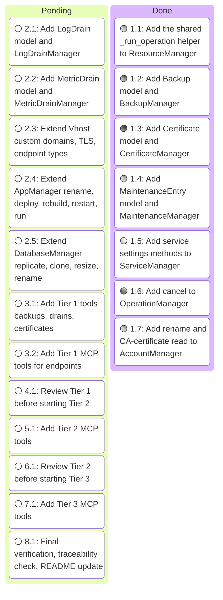
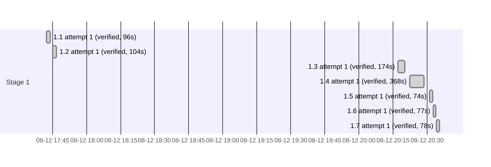

# Execution Ledger: MCP–Aptible API Parity (Deploy API, Tiers 1–3)

<!-- spec-nav:start -->
**Spec navigation:** [State](00_state.md) · [Discovery](01_discovery.md) · [Requirements](02_requirements.md) · [Design](03_design.md) · [Tasks](04_tasks.md) · [Execution](05_execution.md)
<!-- spec-nav:end -->

## Active Wave

Executing in local/sequential controller mode — no Orca session or parallel subagent workers are
configured for this run. One task is implemented, tested, documented, and verified at a time, in
task-list order, per the loop in `spec-execute`.

## Isolation Note

No isolated worktree was created for this run. [`.specs/mcp-api-parity/`](.) is untracked planning
content that must remain reachable from the working checkout, and this is a solo/sequential
session with no concurrent workers requiring isolation — the explicit exception path in
`spec-execute`'s setup section. Work happens directly on a dedicated feature branch instead.

- **Branch:** `feature/mcp-api-parity`
- **Base commit:** `c909ffc` (`main`, clean apart from untracked [`.specs/`](..) and
  [`.DS_Store`](../../.DS_Store))
- **Working tree at run start:** clean except the untracked planning artifacts above

## Self-Hardening Preflight

Depth: `medium` (1 reviewer, `balanced` tier, `medium` reasoning — resolved via `fanout.py
--depth medium`, since the overall task list spans many files with no auth/migration/deployment/
destructive-operation boundary). One reviewer pressure-tested [`03_design.md`](03_design.md) and
[`04_tasks.md`](04_tasks.md) against the real current code. Applied under delegated authority
(all fixes are task-contract corrections, no requirement or approved behavior changed):

- **P0 (blocked task 2.3 as written):** the new `Vhost.type`/`user_domain`/`container_ports`
  fields must be optional with a `None` default, matching the existing `virtual_domain`
  convention — every current fixture and response lacks them, so a required-field declaration
  would break `model_validate` immediately. Fixed in task 2.3.
- **P1s:** task 1.2's `BackupManager.restore` was dropping `destination_account_id` on the floor
  instead of including it in the operation body (contradicted the design's own table); task 2.4's
  `run_command` assumed `AppManager` already has `OperationManager` access, which it doesn't (now
  instructs lazily constructing one, mirroring `AccountManager`'s existing `StackManager`
  pattern); task 2.5 was at risk of copying a real pre-existing bug in
  [`models/database.py`](../../models/database.py) (`delete()` awaits the synchronous
  `wait_for_operation`, masked only because its test mocks with `AsyncMock` instead of
  `MagicMock`) — task 2.5 now fixes that bug while it's already touching the class. Tasks 1.2,
  1.3, 1.4 were missing the `?per_page=5000&no_embed=true` pagination convention every other
  custom list method uses.
- **P2s:** `Operation` was missing explicit `status`/`cancelled` fields (task 1.6 now adds them);
  `AppManager.deploy`'s extended return type (`None` → `App`) is now stated explicitly.
- **Verification-checklist items** (live-API confirmation needed, not resolvable from local code)
  were folded into the `Verification` field of the specific tasks they affect: backup's
  destination-account field name and its database `_links` key, certificate response field names,
  maintenance-entry response shape/account key, service-settings field existence, and the CA
  certificate field's null-vs-absent behavior.

Reviewed the diff against [03_design.md](03_design.md)'s Components & Interfaces tables and the cited
requirements; re-ran `spec-check.py --ready` (passed). Discovery, Requirements, Design, and Tasks
gates remain `approved` in [`00_state.md`](00_state.md) — none of these were substantive
requirement/behavior changes.

## Baseline

| Revision | Command | Exit | Pre-existing failures |
|---|---|---:|---|
| `c909ffc` | `just test` | 0 | none (127 passed) |
| `c909ffc` | `just typecheck` | 0 | none |
| `c909ffc` | `just lint` | 0 | none |

## Recovery

The local session that ran `run-20260812T173015Z` was lost (no surviving Claude Code transcript
for it — confirmed by searching all local session logs for this repository). Reconciled state from
the durable artifacts instead: working tree matches this ledger's task 1.1/1.2 file list exactly
([`models/base.py`](../../models/base.py), [`models/backup.py`](../../models/backup.py),
[`models/__init__.py`](../../models/__init__.py), [`tests/test_base.py`](../../tests/test_base.py),
[`tests/test_backup.py`](../../tests/test_backup.py)), and a fresh `just test`/`just
typecheck`/`just lint` run confirms 140 passed (up from the 127-test baseline), 0 typecheck issues,
0 lint issues. Tasks 1.1 and 1.2 remain `[x]` on this evidence. No implementation edits were lost;
resuming at task 1.3.

## Task Contract Repairs

- **Task 1.3 (`CertificateManager`):** the design's own Components & Interfaces table and the
  task text both named the upload method `create`, but `CertificateManager` subclasses
  `ResourceManager[Certificate, str]`, whose `create(self, data: dict) -> T` is inherited —
  overriding it with `create(self, account_id, certificate_body, private_key)` is an incompatible
  override (confirmed by `mypy`: "Signature of create incompatible with supertype"). Renamed to
  `upload` in [`models/certificate.py`](../../models/certificate.py),
  [`tests/test_certificate.py`](../../tests/test_certificate.py),
  [`03_design.md`](03_design.md)'s `CertificateManager` table and Security row, and
  [`04_tasks.md`](04_tasks.md) task 1.3 — a purely internal-consistency, non-behavioral rename (the
  planned MCP tool name `uploadCertificate` in task 3.1 already matched `upload`, not `create`).
  No requirement or approved behavior changed; Design and Tasks gates remain `approved` in
  [`00_state.md`](00_state.md). Re-ran `spec-check.py --ready` (passed) after the edit.

## Execution Timing

### Task Board

### Run Intervals
| Run ID | Started UTC | Stopped UTC | Elapsed Seconds | Outcome |
|---|---|---|---:|---|
| run-20260812T173015Z | 2026-08-12T17:30:15Z | unknown | unknown | interrupted |
| run-20260812T201522Z | 2026-08-12T20:15:22Z | pending | pending | active |

### Task Attempt Intervals
| Run ID | Stage/Wave | Task | Attempt | Started UTC | Stopped UTC | Elapsed Seconds | Outcome |
|---|---|---|---:|---|---|---:|---|
| run-20260812T173015Z | Stage 1 | 1.1 | 1 | 2026-08-12T17:42:20Z | 2026-08-12T17:43:56Z | 96 | verified |
| run-20260812T173015Z | Stage 1 | 1.2 | 1 | 2026-08-12T17:45:02Z | 2026-08-12T17:46:46Z | 104 | verified |
| run-20260812T201522Z | Stage 1 | 1.3 | 1 | 2026-08-12T20:17:16Z | 2026-08-12T20:20:10Z | 174 | verified |
| run-20260812T201522Z | Stage 1 | 1.4 | 1 | 2026-08-12T20:22:35Z | 2026-08-12T20:28:43Z | 368 | verified |
| run-20260812T201522Z | Stage 1 | 1.5 | 1 | 2026-08-12T20:31:16Z | 2026-08-12T20:32:30Z | 74 | verified |
| run-20260812T201522Z | Stage 1 | 1.6 | 1 | 2026-08-12T20:32:46Z | 2026-08-12T20:34:03Z | 77 | verified |
| run-20260812T201522Z | Stage 1 | 1.7 | 1 | 2026-08-12T20:34:16Z | 2026-08-12T20:35:34Z | 78 | verified |

## Checkpoints

- (none reached yet)

## Integration Decision

- Status: pending
- Base: `main`
- Result: pending
- Post-integration verification: pending

### Execution Gantt

